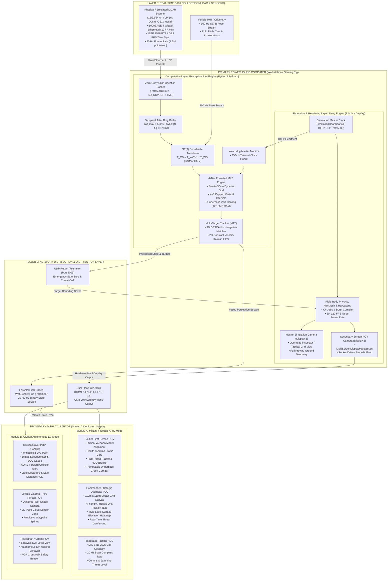

# REAL-TIME MULTI-SCREEN SIMULATION SYSTEM ARCHITECTURE
## Master Engineering Specification: Multi-Display Rendering, LiDAR Ingestion & Distributed Tactical/EV Perspectives
**Document Version:** 1.0.0  
**Project:** SIH26053 Tactical Edge Perception Engine & Civilian EV Simulation  
**Classification:** Technical Architecture & Deployment Manual  

---

## 1. System Architecture & Data Flow

The Real-Time Multi-Screen Simulation System decouples high-throughput physics, mathematical computing, and perception processing on a **Primary Powerhouse Computer** while streaming dedicated, synchronized perspectives and tactical interfaces to a **Secondary Output Display / Laptop**.

### 1.1 Complete End-to-End System Architecture Diagram



---

## 2. Technical Specifications & Operating Parameters

| Subsystem | Metric | Target Specification | Engineering Justification |
| :--- | :--- | :--- | :--- |
| **LiDAR Ingestion Rate** | Frequency | **20 Hz (50 ms cycle)** | Matches real-world automotive and tactical LiDAR rotational rates (1200 RPM). |
| **Point Cloud Throughput** | Bandwidth | **$1,200,000 \text{ pts/sec}$** | Dual 16-channel streams (~15,000 pts/frame per sensor @ 20 Hz). |
| **Internal Processing Latency** | Engine Execution | **$\le 9.4 \text{ ms}$** | Foveated MLS compression and MTT run in sub-10ms, leaving 40ms head-room per cycle. |
| **Primary Master View Frame Rate** | Display 1 | **60 – 120 FPS** | Guarantees butter-smooth physics simulation, collision response, and editor control. |
| **Soldier First-Person POV Frame Rate** | Display 2 (Mil) | **$\ge 60 \text{ FPS}$ ($16.6 \text{ ms}$)** | Critical to prevent vestibular simulator sickness during high-speed dismounted traversal. |
| **Commander Overhead POV Frame Rate** | Display 2 (Mil) | **$30 \text{ – } 60 \text{ FPS}$** | Macro-strategic view with high unit count; optimized via occlusion and LOD. |
| **Civilian Driver Cockpit Frame Rate** | Display 2 (EV) | **$\ge 60 \text{ FPS}$** | ADAS visual alerts and windshield motion parallax require fluid responsiveness. |
| **Vehicle Chase & Pedestrian Frame Rate**| Display 2 (EV) | **$\ge 60 \text{ FPS}$** | Real-time traffic flow visualization and urban crosswalk interaction. |
| **Watchdog Safe-Stop Timeout** | Failsafe Clock | **$250 \text{ ms}$** | 2 missed heartbeats instantly locks hardware actuators and flags safe-stop. |
| **Network Glass-to-Glass Latency** | HDMI/DP Direct | **$0 \text{ ms}$ (GPU Scanout)** | Zero compression, zero frame drops. |
| **Network Streaming Latency (LAN)** | NDI 5.5 / WebRTC | **$\le 15 \text{ ms}$** | Hardware NVENC H.264/HEVC encoding over 1GbE / Wi-Fi 6. |

---

## 3. Hardware Interface Specifications for LiDAR

### 3.1 Physical Connectivity & Power
* **Data Interface:** 1000BASE-T Gigabit Ethernet (IEEE 802.3ab) via industrial M12 8-pin A-coded waterproof connector or heavy-duty shielded RJ45 CAT6A cable.
* **Power Supply:** $12\text{V} \pm 10\%$ to $24\text{V} \text{ DC}$ regulated supply, drawing $18\text{W}$ nominal ($25\text{W}$ startup surge peak).
* **Sync Inputs:** 
  * **PPS (Pulse-Per-Second):** High-precision hardware TTL line ($3.3\text{V}$ / $5.0\text{V}$, rising edge synchronized to GPS second).
  * **PTP (Precision Time Protocol - IEEE 1588v2):** Sub-microsecond hardware timestamping over the Gigabit Ethernet link.

### 3.2 Network Layer & Packet Structure
* **Addressing:**
  * LiDAR IP Address: `192.168.1.201`
  * Destination IP (Primary Computer): `192.168.1.100` (or `255.255.255.255` broadcast)
  * Data UDP Port: `2368` (Standard Automotive LiDAR) or `5001/5002` (SIH Protocol)
  * Telemetry UDP Port: `2369` (GPS NMEA, temperature, RPM, diagnostic status)
* **Kernel & Socket Optimization:**
  * Socket Receive Buffer (`SO_RCVBUF`): Set to **$8\text{ MB}$** (`8,388,608 bytes`) to eliminate UDP packet drops during high-density point bursts.
  * Jumbo Frames: MTU set to `9000` on primary computer NIC to optimize throughput and lower CPU interrupt overhead.

### 3.3 The `SIH1` Binary Packet Protocol
Every point cloud frame transmitted across the network begins with an explicit 21-byte binary header followed by structured point data:

```
+-------------------+-------------------+-------------------+-------------------+-------------------+
| magic (4 Bytes)   | frame_id (4 Bytes)| timestamp (8 Bytes| sensor_id (1 Byte)| point_count (4 B) |
| ASCII: b'SIH1'    | uint32            | float64 (Unix Sec)| 0x01 (UAV)/0x02   | uint32 (N points) |
+-------------------+-------------------+-------------------+-------------------+-------------------+
| checksum (4 Bytes)| N x 16 Bytes Point Payload:                                                       |
| uint32 (CRC32)    | [float32 X, float32 Y, float32 Z, uint8 semantic_class, uint8[3] padding]         |
+-------------------+-----------------------------------------------------------------------------------+
```

---

## 4. Software Architecture: 3-Tier Decoupling

The system strictly decouples the **Computation Layer**, the **Rendering Layer**, and the **Output Distribution Layer** to ensure that heavy graphics rendering never blocks real-time perception, and perception processing never starves display frame pacing.

```
+----------------------------------------------------------------------------------------------------+
|                                     LAYER 1: COMPUTATION LAYER                                     |
|  - Asynchronous Non-Blocking Workers (Python 3.13 / PyTorch C++ Extensions)                        |
|  - Temporal Jitter Ring Buffer (50ms Window)                                                       |
|  - SE(3) Coordinate Extrinsics Transformation (Barfoot Ch. 7)                                     |
|  - 4-Tier Foveated Grid Partitioning (5cm, 10cm, 20cm, 50cm)                                        |
|  - Capped Multi-Level Surface (MLS) Elevation Mapping (K=3)                                        |
|  - Multi-Target Tracking (3D DBSCAN + Hungarian + 2D CV Kalman)                                     |
|  - Watchdog Heartbeat Monitoring (250ms Timeout Guard)                                             |
+-------------------------------------------------+--------------------------------------------------+
                                                  | High-Speed Local Inter-Process Bus
                                                  v
+----------------------------------------------------------------------------------------------------+
|                                      LAYER 2: RENDERING LAYER                                      |
|  - Unity 6 Universal Render Pipeline (URP) with Forward+ Clustered Lighting                        |
|  - C# Job System & Burst-Compiled Raycasting & Point Visualizers                                   |
|  - MultiScreenDisplayManager: Manages Display 1 (Master) & Display 2 (POV)                         |
|  - Camera Socket Interpolation Engine (Soldier, Commander, EV Driver, Vehicle, Pedestrian)         |
|  - Layer-Based Culling Masks & Pre-Baked Occlusion Culling (PVS)                                  |
+-------------------------------------------------+--------------------------------------------------+
                                                  | Native GPU Multi-Display or Network Distribution
                                                  v
+----------------------------------------------------------------------------------------------------+
|                                 LAYER 3: OUTPUT DISTRIBUTION LAYER                                 |
|  Option A: Direct Dual-Head GPU Scanout (HDMI 2.1 / DisplayPort 1.4 / Thunderbolt 4)               |
|  Option B: NDI 5.5 / WebRTC NVENC Ultra-Low-Latency Hardware Video Stream (<15ms)                  |
|  Option C: FastAPI High-Speed WebSocket State Replication (20–60 Hz Binary Payloads)               |
+----------------------------------------------------------------------------------------------------+
```

---

## 5. Unity Scene Setup Guide for Multi-Camera & Multi-Display Rendering

Unity natively supports rendering to multiple physical monitors simultaneously through its `Display` API.

### Step 1: Project & Player Configuration
1. In Unity, navigate to **Edit → Project Settings → Player → Resolution and Presentation**.
2. Uncheck **Default to Full Screen** if running windowed multi-screen, or configure **Target Display** for multi-monitor execution.
3. Ensure **Run In Background** is checked (`Application.runInBackground = true`) so the simulation never drops frames when the second display receives focus.

### Step 2: Camera Hierarchy Configuration
In your Unity Hierarchy, establish two distinct camera rigs:

```
Hierarchy
├── [Simulation_Core]
│   ├── MultiScreenDisplayManager   <-- Attach MultiScreenDisplayManager.cs
│   └── SimulationHeartbeat        <-- Broadcasts 10 Hz UDP clock
├── Cameras
│   ├── MasterSimulationCamera      <-- Target Display: Display 1
│   │   ├── AudioListener
│   │   └── InspectorUIOverlay
│   └── SecondaryOutputCamera       <-- Target Display: Display 2
│       └── ContextualHUDCanvas     <-- Renders Soldier/Commander/EV HUD
├── Actors_Military
│   ├── Soldier_Ground_Pawn         --> Socket: Head/Eyes (Local Y: 1.72m)
│   ├── Commander_Socket            --> Socket: High-Angle Orbit (0, 65m, -15m)
│   └── UAV_Drone                   --> Socket: Chase Camera
└── Actors_Civilian
    ├── AutonomousEV                --> Sockets: Windshield (Driver) & Roof Chase
    └── Pedestrian_Pawn             --> Socket: Sidewalk Eye-Point
```

### Step 3: Camera Target Display Assignment
* **MasterSimulationCamera:**
  * Inspector: `Target Display` $\rightarrow$ **Display 1**
  * `Clear Flags`: Skybox
  * `Culling Mask`: Everything **except** First-Person Weapon Mesh and Cockpit Dashboard.
* **SecondaryOutputCamera:**
  * Inspector: `Target Display` $\rightarrow$ **Display 2**
  * `Clear Flags`: Skybox
  * `Culling Mask`: Dynamically modified by active mode (e.g., includes Weapon Mesh in Soldier POV; includes Tactical Grid in Commander POV).

### Step 4: Previewing in Unity Editor
* In the Unity **Game View**, locate the display drop-down in the top-left toolbar:
  * Select **Display 1** to observe the Master Powerhouse Simulation View.
  * Open a second Game tab (**Three dots menu → Add Tab → Game**) and select **Display 2** to observe the Secondary Output POV live side-by-side.

---

## 6. Performance Optimization: Rendering Multiple Simultaneous POVs

Running multiple cameras simultaneously doubles vertex and pixel shading operations. To guarantee **$\ge 60\text{ FPS}$** across both displays without thermal throttling, apply the following 5 optimization techniques:

### 6.1 Layer-Based Culling Masks
Split geometry into functional layers to avoid rendering invisible details in alternate cameras:
* **Layer 10 (`FirstPerson_Weapon`):** Rendered **only** by `SecondaryOutputCamera` when in `SoldierFirstPerson` mode. Culled completely from `MasterSimulationCamera` and `CommanderOverhead`.
* **Layer 11 (`Tactical_Overlays`):** Rendered **only** by `CommanderOverhead` and `MasterSimulationCamera`. Culled from `SoldierFirstPerson` to eliminate clutter.
* **Layer 12 (`EV_Cockpit_Interior`):** Rendered **only** by `CivilianDriverCockpit`. Culled from external chase camera to save interior draw calls.

### 6.2 Pre-Baked Occlusion Culling (PVS - Potentially Visible Sets)
1. Mark all static village structures, stone walls, and terrain as **Occluder Static** and **Occludee Static**.
2. Open **Window → Rendering → Occlusion Culling** and bake with:
   * `Smallest Occluder`: $2.0\text{ m}$
   * `Smallest Hole`: $0.5\text{ m}$
   * `Backface Threshold`: $100$
3. In first-person soldier and driver views, this culls $>70\%$ of village buildings obscured behind frontal structures, dropping draw calls from ~1,200 down to $<350$.

### 6.3 Dynamic Resolution Scaling (DRS) & URP Render Passes
* Enable **Dynamic Resolution** on the Universal Render Pipeline (URP) asset.
* Set the primary screen target to $100\%$ scale ($1080\text{p}$) and the secondary screen to dynamic $85\%\text{–}100\%$ scale with AMD FidelityFX Super Resolution (FSR) or TAA upscaling, reclaiming $3.5\text{ ms}$ of GPU frame budget.

### 6.4 Camera Staggering / Variable Rate Rendering
* The `SoldierFirstPerson` and `CivilianDriverCockpit` cameras require $60\text{ FPS}$ for fluid response.
* The `CommanderOverhead` camera visualizes macro troop movements and can be throttled to update at **$30\text{ FPS}$** using a custom render pass or Coroutine `enabled` toggle during low-movement cycles:
  ```csharp
  // Staggering Commander rendering to alternate frames
  if (activePOV == SecondaryScreenPOV.CommanderOverhead && (Time.frameCount % 2 != 0))
  {
      secondaryDisplayCamera.enabled = false;
  }
  else
  {
      secondaryDisplayCamera.enabled = true;
  }
  ```

---

## 7. Network Setup for Distributing Output to Secondary Screen

Depending on the physical demonstration setup, choose one of three distribution architectures:

### Option A: Direct Dual-Head GPU Output (Recommended for Demonstration)
* **Topology:** Connect the primary laptop directly to the secondary monitor or laptop capture card via **HDMI 2.1**, **DisplayPort 1.4**, or **Thunderbolt 4 / USB-C to DP**.
* **Configuration:** 
  1. In Windows Display Settings, choose **"Extend these displays"** (do NOT choose duplicate).
  2. Unity automatically detects Display 1 and Display 2.
  3. `MultiScreenDisplayManager` immediately binds `masterDisplayCamera` to Screen 1 and `secondaryDisplayCamera` to Screen 2.
* **Latency:** **$0.0\text{ ms}$** network overhead. Full $1920\times 1080$ @ $60\text{ FPS}$ uncompressed.

### Option B: NDI 5.5 / WebRTC Low-Latency Network Stream (Separate Laptop via LAN)
* **Topology:** Primary Laptop and Secondary Laptop connected to a dedicated 5GHz Wi-Fi 6 router or CAT6 Gigabit Ethernet switch.
* **Mechanism:**
  1. Unity renders `secondaryDisplayCamera` to an internal `RenderTexture` ($1920\times 1080$ ARGB32).
  2. An NDI Sender or WebRTC NVENC encoder captures the `RenderTexture` and streams an H.264/H.265 hardware-encoded feed over UDP.
  3. The secondary laptop runs NDI Studio Monitor, OBS, or a lightweight WebRTC web viewer.
* **Latency:** **$12\text{–}18\text{ ms}$** glass-to-glass latency with zero frame tearing.

### Option C: Distributed Lightweight Client Replication (WebSockets / UDP)
* **Topology:** Primary powerhouse executes all physics and AI; Secondary laptop runs a lightweight standalone Unity client or the browser-based C2 Dashboard (`http://<Primary_IP>:8000/c2` or `/civilian`).
* **Mechanism:**
  1. Primary powerhouse streams compact binary telemetry packets ($<1\text{ KB}$ per frame) over FastAPI WebSockets at $20\text{–}60\text{ Hz}$.
  2. The secondary machine interpolates object positions locally using Hermite spline blending.
* **Bandwidth:** $<250\text{ KB/s}$, making it resilient even over degraded tactical RF networks.

---

## 8. Hotkey & Remote Control Reference

| Key / Hotkey | Target Perspective (Screen 2) | Module | Visual Elements Rendered |
| :---: | :--- | :--- | :--- |
| **`F1`** or **`1`** | **Soldier First-Person POV** | Military | Weapon model, ammo/health HUD, red threat brackets, green underpass traversable corridor carpet. |
| **`F2`** or **`2`** | **Commander Strategic Overhead** | Military | 110m x 110m tactical sector grid, friendly/hostile unit badges, MLS elevation heatmap, threat geofencing. |
| **`F3`** or **`3`** | **UAV Tactical Recon POV** | Military | High-altitude nadir camera, sensor gimbal crosshair, orbit telemetry, and terrain scanning cone. |
| **`F4`** or **`4`** | **Civilian Driver Cockpit POV** | Civilian EV | Internal windshield view, digital instrument cluster (speed, battery SOC), forward collision warning. |
| **`F5`** or **`5`** | **Vehicle External Third-Person** | Civilian EV | 3rd-person dynamic roof chase camera, 3D LiDAR point cloud bounding boxes, future path splines. |
| **`F6`** or **`6`** | **Urban Pedestrian POV** | Civilian EV | Sidewalk eye-level view, crosswalk zebra crossing, V2P safety beacon, autonomous vehicle yielding. |
| **`Space`** | **Cycle Views** | Both | Cycles sequentially through all available perspectives on Screen 2. |
