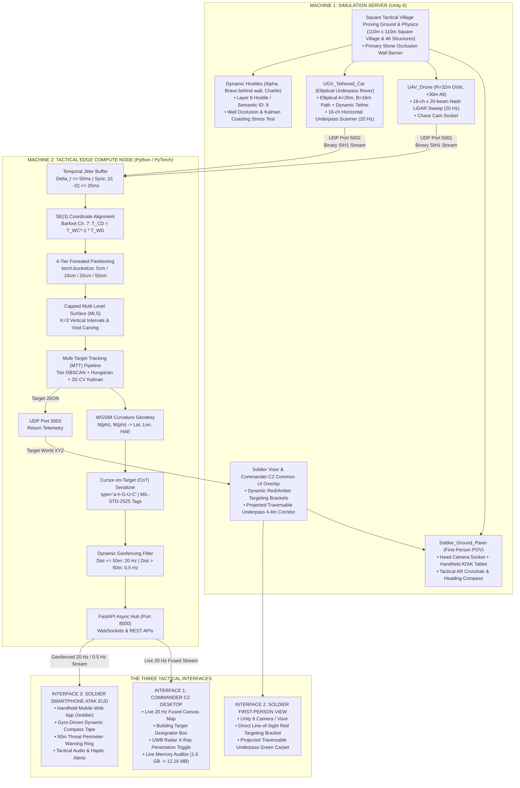
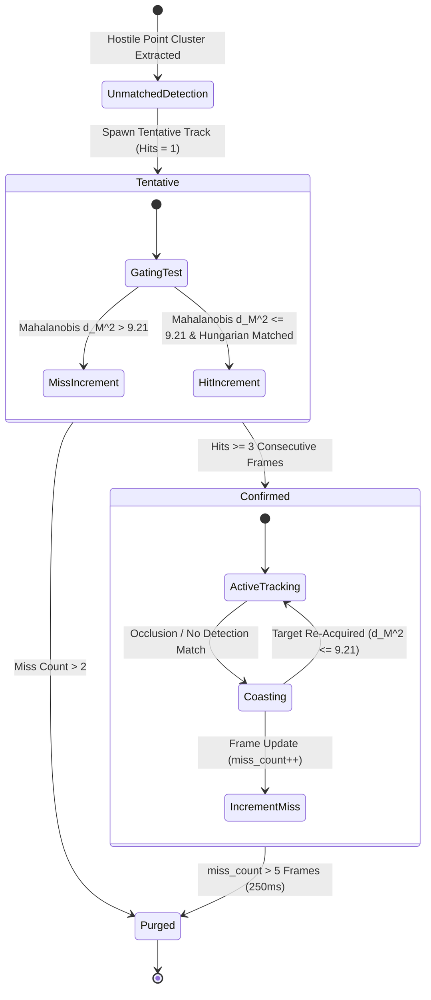

# Tactical Edge Perception Engine (SIH26053)
## Master Technical Architecture, Mathematical Foundations & Implementation Specification (v4.0)

**Problem Statement ID:** SIH26053  
**Title:** Adaptive Variable Resolution 2.5D LiDAR Mapping for Dynamic Environment Perception  
**Organization / Department:** DRDO / Department of Defence Production (iDEX)  
**Domain:** Smart Vehicles / Defense Robotics (Manned-Unmanned Teaming — MUM-T)  
**Classification:** Unclassified / Technical Architecture Specification  

---

# 1. Operational Context & Strategic Pivot

### 1.1 Problem Statement & Background
The Smart India Hackathon Problem Statement **SIH26053**, issued by the Defence Research and Development Organisation (**DRDO**) / Department of Defence Production (**iDEX**), specifies:
> *"Optimization of 3D LiDAR point clouds into 2.5D spatial maps for dynamic environment perception on resource-constrained platforms."*

While originally contextualized for civilian autonomous electric vehicles (EVs), this project executes a **strategic defense pivot** into **Manned-Unmanned Teaming (MUM-T)**. An airborne Unmanned Aerial Vehicle (UAV) and a terrestrial Unmanned Ground Vehicle (UGV) collaborate in GPS-degraded, off-road border environments to map complex terrain, identify traversable corridors under obstacle cover, track hostile combatants, and stream actionable targeting intelligence directly to dismounted frontline soldiers and command posts.

### 1.2 The Edge Compute Bottleneck (SWaP Rationale)
Tactical drones and mobile robots operate under extreme **Size, Weight, and Power (SWaP)** constraints. An embedded edge processor (e.g., NVIDIA Jetson Orin Nano, Jetson Xavier NX) possesses bounded RAM (typically $8\text{ GB}$ shared between CPU and GPU) and a tight $10\text{–}25\text{ W}$ power envelope:

1. **The Dense 3D Voxel Failure:**  
   A standard uniform 3D voxel grid over a $100\text{ m} \times 100\text{ m} \times 20\text{ m}$ tactical volume at a fine $5\text{ cm}$ resolution yields:
   $$\left(\frac{100}{0.05}\right) \times \left(\frac{100}{0.05}\right) \times \left(\frac{20}{0.05}\right) = 2000 \times 2000 \times 400 = 1.6 \times 10^9 \text{ voxels}$$
   At just 1 byte per voxel (binary occupancy only), this requires **$1.6\text{ GB}$ of static RAM per frame buffer**. Attempting to ingest, clear, or update $1.6\text{ GB}$ at $20\text{ Hz}$ consumes $32\text{ GB/s}$ of internal memory bandwidth, causing severe cache thrashing, thermal throttling, and frame rates dropping below $2\text{ FPS}$.

2. **The Flat 2D Grid Failure:**  
   Flattening 3D point clouds into standard 2D occupancy grids discards vertical elevation ($Z$) entirely. This blinds autonomous path planners to drivable slopes, curbs, ditches, potholes, and elevated hostile positions.

3. **The Single-Surface 2.5D Failure:**  
   Standard 2.5D elevation maps store a single $(z_{\max}, z_{\min})$ pair per cell. In environments with overhanging structures (e.g., concrete bridges, tree canopies, building overhangs, tunnel portals), a single elevation band collapses the column into a solid block, falsely marking traversable void spaces as solid impassable obstacles.

4. **The Uniform Resolution Waste:**  
   A uniform grid allocates equal spatial resolution at $1\text{ m}$ from the sensor as it does at $100\text{ m}$. In reality, near-field micro-terrain requires centimeter-level precision for obstacle clearance and safe landing, while far-field terrain only requires coarse decimeter resolution for general path planning.

### 1.3 The Engine Solution
This engine implements a **4-Tier Foveated Multi-Level Surface (MLS) Representation**:
* **Foveated Compression:** Dynamically scales cell resolution from **$5\text{ cm}$** in the near-field ($0\text{–}10\text{ m}$) to **$50\text{ cm}$** in the far-field ($60\text{–}100\text{ m}$), eliminating $>90\%$ of redundant cells.
* **Capped Multi-Level Surface (MLS) Intervals ($K=3$):** Stores up to 3 discrete vertical surface intervals per column, explicitly preserving the traversable void space beneath bridges and overhangs.
* **Empirical Performance:** Reduces peak frame buffer memory from **$1,600\text{ MB}$ down to $12.16\text{ MB}$ ($>99.24\%$ RAM savings)**, executing deterministically in **$< 10\text{ ms}$ at $\ge 20\text{ FPS}$**.

---

# 2. System Architecture & Hardware Topology



### 2.1 Hardware Roles & Network Agnosticism
* **Machine 1 (Simulation Server):** High-GPU workstation running Unity 6 on drive `B:`. Responsible for physics, lighting, NavMesh pathfinding, and real-time multi-threaded C# Job raycasting.
* **Machine 2 (Edge Compute Node):** Standard laptop or embedded board running the Python perception engine. Proves software runs independently of the gaming laptop's discrete GPU.
* **Machine 3 (Soldier EUD):** Commercial smartphone connected to local Wi-Fi, opening `http://<Machine_2_IP>:8000/soldier`.
* **Zero-Recompile Switching (Single-PC vs. Dual-PC):**
  * In `config.py`: UDP listeners bind to `0.0.0.0` (accepts both `127.0.0.1` and LAN `192.168.x.x`).
  * In Unity C#: `targetIp` is exposed in `LidarJobStreamer.cs` as a public Inspector field. To switch from local development to a two-laptop demo, the user simply enters Machine 2's IP address into the Inspector without recompiling code.

### 2.2 Binary UDP Protocol & Semantic Classification Specification
Every datagram transmitted from Unity to Python follows an explicit 21-byte binary header:
* `magic`: `b'SIH1'` (4 bytes ASCII)
* `frame_id`: `uint32` (4 bytes)
* `timestamp`: `float64` (8 bytes, Unix epoch timestamp)
* `sensor_type`: `uint8` (1 byte: `0x01` = UAV, `0x02` = UGV, `0x03` = UWB)
* `point_count`: `uint32` (4 bytes)
* `checksum`: `uint32` (4 bytes, CRC32)
* **Payload:** $N \times 16\text{ bytes}$ (`float32 x, float32 y, float32 z, uint8 semantic_class, uint8[3] padding`).

**Physical Material to Semantic ID Mapping:**
| Semantic ID | Semantic Class | Physical Material | Color Code | Description |
| :---: | :--- | :--- | :--- | :--- |
| `0` | `GROUND` | `PM_Ground` | Gray / Brown | Bare terrain, dirt, mud |
| `1` | `ROAD` | `PM_Road` | Dark Gray | Cobblestone / asphalt traversable street |
| `2` | `OBSTACLE` | `PM_Obstacle` | Slate / Brick | Village buildings, ruins, walls |
| `3` | `OVERHANG` | `PM_Bridge` | Orange | Bridge deck, tunnels, building eaves |
| `8` | `TARGET` | `Mat_Hostile` | Bright Red | Hostile combatant / vehicle (`HostilePatrol` / Layer 8) |

### 2.3 Temporal Jitter Buffer
Machine 2 maintains a sliding temporal ring buffer with window $\Delta t_{\max} = 50\text{ ms}$:
* A fusion cycle executes only when UAV and UGV sweeps satisfy:
  $$|t_{\text{uav}} - t_{\text{ugv}}| \le 25\text{ ms} \quad \text{or} \quad \text{frame\_id}_{\text{uav}} == \text{frame\_id}_{\text{ugv}}$$
* Out-of-window or orphaned packets are purged immediately. Spatial alignment is never calculated against stale temporal data.

### 2.4 The Five-Phase Closed-Loop Tactical & Cinematic Sequence
To bring the entire mathematical, networking, and robotic architecture together into a seamless, cinematic, and functional tactical loop, the simulation orchestrates the following five phases in **Unity 6**:

1. **Phase 1: Environment & Threat Staging (The Proving Ground)**
   * **Tactical Map:** Native `TacticalProvingGround.unity` 110m × 110m square village containing 46 diverse structures, an open $4.4\text{m}$ vertical underpass bridge, an 18m church spire, and the `Stone_Occlusion_Wall_Primary` ($16\text{m} \times 2.5\text{m} \times 0.8\text{m}$) barrier.
   * **Dynamic Hostiles (`HostilePatrol.cs`):** Tactical combatants assigned Layer `Hostile` (Semantic ID: 8).
   * **Deterministic Patrol Routes (The Crossing & Occlusion Test):** Dynamic hostiles patrol the square village; Target Bravo passes directly behind the primary stone wall to rigorously stress-test the Kalman filter coasting and Hungarian data association during line-of-sight occlusion.

2. **Phase 2: Soldier POV & ATAK EUD Setup (The Interface)**
   * **Soldier Pawn (`Soldier_Ground_Pawn`):** First-person camera mounted on the head socket; views square village and underpass with AR crosshair, compass heading tape, and underpass clearance gauge.
   * **Dual Tactical Dashboards:** Live Commander C2 Dashboard (`/c2`) and Soldier ATAK Smartphone EUD (`/soldier`) served over WebSockets from the Python perception node.

3. **Phase 3: Multi-POV Camera Switching & Kinematics**
   * **Camera Controller (`MUMT_CameraController.cs`):** Instant hotkey switching between `[1]` Soldier AR Visor POV, `[2]` UAV Aerial Chase POV, `[3]` UGV Rover Dash POV, and `[4]` Commander Tactical Overview (`Space` for fast toggle).
   * **Coordinated Kinematics:** UAV executes circular orbit ($R = 32\text{m}$, altitude $= +30\text{m}$, $14^\circ/\text{s}$). Concurrently, `UGV_Tethered_Car` navigates the elliptical ground route ($A = 26\text{m}, B = 16\text{m}$) driving through the underpass void beneath the drone's tether line.

4. **Phase 4: Continuous Scanning & Edge Math (The Processing)**
   * **Continuous 20 Hz LiDAR (`LidarJobStreamer.cs`):** Multi-threaded Unity C# Job System raycasts UAV nadir cone (Port 5001) and UGV horizontal sweep (Port 5002) against environment and hostiles, streaming 16-byte point records in binary `SIH1` datagrams.
   * **Edge Compute Ingestion:** Python node ingests packets, temporal jitter buffer aligns frames ($|t_1 - t_2| \le 25\text{ ms}$), $SE(3)$ register transforms points into common frame.
   * **Foveated MLS & MTT:** Static geometry is flattened into the 4-tier Triebel capped MLS grid ($K=3$) preserving underpass voids. Moving `TARGET (ID: 8)` points are clustered via Tier-DBSCAN, and tracks are filtered with 2D CV Kalman filters and Mahalanobis gating.

5. **Phase 5: Closed-Loop HUD Feedback (The Result)**
   * **WGS84 & CoT Conversion:** Target Cartesian $(x,y)$ coordinates are converted to Geodetic WGS84 Lat/Lon/HAE and serialized to MIL-STD-2525 Cursor-on-Target XML.
   * **Telemetry Return & HUD Projection (`ThreatReticleManager.cs`):** Target coordinates are streamed over UDP Port 5003 to Unity. Threat Reticle Manager projects dynamic MIL-STD-2525 diamond reticles `[ HOSTILE #N ]` (with range, speed, and LOS/Coasting status) in both Soldier AR Visor and Commander Tactical Overview.

---

# 3. Grounded Mathematical Foundations

### 3.1 Relative $SE(3)$ Frame Alignment (Barfoot, Chapter 7)
The closed-form relative transformation matrix $T_{CD}$ aligning the drone's measurements directly into the crawler's reference frame is:
$$T_{CD} = T_{WC}^{-1} T_{WD} = \begin{bmatrix} C_{WC}^T C_{WD} & C_{WC}^T (\mathbf{r}_W^{WD} - \mathbf{r}_W^{WC}) \\ \mathbf{0}^T & 1 \end{bmatrix} = \begin{bmatrix} C_{CD} & \mathbf{r}_C^{CD} \\ \mathbf{0}^T & 1 \end{bmatrix}$$
For any point $\mathbf{p}_D = [x_D, y_D, z_D]^T$ captured by the drone:
$$\mathbf{p}_C = C_{CD} \mathbf{p}_D + \mathbf{r}_C^{CD}$$

### 3.2 Loop-Free 4-Tier Foveated Grid (de Berg Ch. 14 & PyTorch Docs)
Spatial resolution $\Delta$ scales with radial horizontal distance $r = \sqrt{x^2 + y^2}$:
* **Tier 1 (Fovea):** $0\text{ m} \le r \le 10\text{ m}$ @ **$5\text{ cm}$**
* **Tier 2 (Near-Field):** $10\text{ m} < r \le 30\text{ m}$ @ **$10\text{ cm}$**
* **Tier 3 (Mid-Field):** $30\text{ m} < r \le 60\text{ m}$ @ **$20\text{ cm}$**
* **Tier 4 (Far-Field):** $60\text{ m} < r \le 100\text{ m}$ @ **$50\text{ cm}$**
* Vectorized allocation: `tier_ids = torch.bucketize(r, torch.tensor([10.0, 30.0, 60.0, 100.0]))`.
* Zero-crossing guard: If $|x| < 10^{-6}$, clamp $x = +0.0$.
* Anti-aliasing key: `(tier_id, ix, iy)` prevents cross-tier hash collisions.

### 3.3 Capped Multi-Level Surface (MLS) Intervals (Triebel, Pfaff, Burgard)
* Stores up to $K=3$ surface intervals $[z_{\text{low}}, z_{\text{high}}]$ per $(x, y)$ column.
* Merging threshold $\tau_{\text{merge}} = 0.10\text{ m}$.
* If vertical gap $\gamma > 1.0\text{ m}$, a separate interval is created. This retains the road at $z \in [0.0, 0.2\text{ m}]$ and the bridge deck at $z \in [4.8, 5.2\text{ m}]$, **preserving the open traversable corridor under the bridge**.

### 3.4 Kinematic Multi-Target Tracking Pipeline (Bar-Shalom Ch. 6 & Labbe Ch. 6, 8)
* State: $\mathbf{x} = [x, y, \dot{x}, \dot{y}]^T$.
* Continuous White Noise Acceleration (CWNA) process noise covariance $\mathbf{Q}$:
  $$\mathbf{Q} = q \begin{bmatrix} \frac{\Delta t^3}{3} & 0 & \frac{\Delta t^2}{2} & 0 \\ 0 & \frac{\Delta t^3}{3} & 0 & \frac{\Delta t^2}{2} \\ \frac{\Delta t^2}{2} & 0 & \Delta t & 0 \\ 0 & \frac{\Delta t^2}{2} & 0 & \Delta t \end{bmatrix}, \quad q \approx \frac{a_{\max}^2}{3}$$
* Mahalanobis validation gate: $d_M^2 = \mathbf{y}^T \mathbf{S}^{-1} \mathbf{y} \le 9.21$ ($99\%$ $\chi^2$ 2-DOF gate).
* Hungarian data association on cost matrix $C_{ij}$ guarantees zero identity swaps.

### 3.5 Local Tangent Plane WGS84 Geodetic Projection (`cot_formatter.py`)
* Radii of curvature at anchor latitude $\phi_0$:
  $$N(\phi_0) = \frac{a}{\sqrt{1 - e^2 \sin^2(\phi_0)}}, \quad M(\phi_0) = \frac{a(1 - e^2)}{(1 - e^2 \sin^2(\phi_0))^{3/2}}$$
* Converts $(x, y, z)$ meters to Latitude, Longitude, and HAE altitude with sub-$5\text{ mm}$ precision at 7 decimal places.

---

# 4. Multi-Target Tracking Lifecycle State Machine



---

# 5. Master Implementation Roadmap

```
========================================================================================
MILESTONE 0: FOUNDATIONS & MATHEMATICAL CORE (Days 1–2)
========================================================================================
[ ] Task 0.1: Initialize isolated Python virtual environment via `uv venv`.
[ ] Task 0.2: Lock root dependencies in `requirements.txt` (torch, fastapi, uvicorn, scipy, etc.).
[ ] Task 0.3: Create master `config.py` (tier radii, resolutions, ports, datum constants).
[ ] Task 0.4: Implement `core_math/foveated_grid.py` (loop-free PyTorch 4-tier partitioning).
[ ] Task 0.5: Implement `core_math/mls_engine.py` (Triebel K=3 capped intervals & void retention).
[ ] Task 0.6: Implement `core_math/registration.py` (Barfoot SE(3) coordinate alignment).
[ ] Task 0.7: Write and execute test harnesses:
              - `tests/test_foveated_grid.py` (boundary stability at 10m, zero-crossing, speed).
              - `tests/test_mls_engine.py` (proves void retention under bridges).
---> GATE 0: `uv run pytest tests/test_foveated_grid.py tests/test_mls_engine.py -v` passes 100%.

========================================================================================
MILESTONE 1: MULTI-TARGET TRACKING & TELEMETRY (Days 3–4)
========================================================================================
[ ] Task 1.1: Implement `tracking/tier_dbscan.py` (dynamic epsilon clustering).
[ ] Task 1.2: Implement `tracking/kalman_tracker.py` (2D CV Kalman filter with Bar-Shalom CWNA Q).
[ ] Task 1.3: Implement `tracking/hungarian_associator.py` (Mahalanobis gate gamma=9.21 + Hungarian).
[ ] Task 1.4: Implement `tracking/mtt_manager.py` (track lifecycle: Tentative/Confirmed/Coasting/Dead).
[ ] Task 1.5: Implement `c2_interface/cot_formatter.py` (validated WGS84Converter & CoT XML).
[ ] Task 1.6: Write and execute test harnesses:
              - `tests/test_tracking_mtt.py` (verifies zero track-swaps during target crossing).
              - `tests/test_cot_wgs84.py` (verifies sub-5mm geodetic precision & valid CoT schema).
---> GATE 1: `uv run pytest tests/test_tracking_mtt.py tests/test_cot_wgs84.py -v` passes 100%.

========================================================================================
MILESTONE 2: INGESTION, UDP PROTOCOL & JITTER BUFFER (Day 5)
========================================================================================
[ ] Task 2.1: Implement `ingestion/udp_protocol.py` (binary struct unpacker for 21-byte header).
[ ] Task 2.2: Implement `ingestion/jitter_buffer.py` (50ms ring buffer, 25ms sync pairing).
[ ] Task 2.3: Implement `ingestion/udp_receiver.py` (async non-blocking UDP socket server).
[ ] Task 2.4: Write and execute test harness:
              - `tests/test_jitter_buffer.py` (simulates packet drops, out-of-order jitter).
---> GATE 2: `uv run pytest tests/test_jitter_buffer.py -v` passes 100%.

========================================================================================
MILESTONE 3: DUAL WEB INTERFACES (Day 6)
========================================================================================
[ ] Task 3.1: Implement `c2_interface/server.py` (FastAPI REST endpoints & 20 Hz WebSocket hub).
[ ] Task 3.2: Implement `c2_interface/geofence_router.py` (50m threat perimeter filter).
[ ] Task 3.3: Build `c2_interface/static/c2_dashboard.html` (Interface 1: Commander C2 Canvas Map,
              Target Designator box measurement, UWB x-ray toggle, RAM benchmark gauge).
[ ] Task 3.4: Build `c2_interface/static/soldier_eud.html` (Interface 3: Smartphone ATAK EUD,
              gyro rotating compass tape, 50m threat warning ring, haptics, reticle mode).
[ ] Task 3.5: Implement `tests/test_memory_benchmark.py` (programmatic audit: 1.6 GB vs 12.16 MB).
---> GATE 3: Verify live WebSocket feed on local desktop (`/c2`) and mobile browser (`/soldier`).

========================================================================================
MILESTONE 4: UNITY 6 AUTOMATION & CLOSED LOOP (Day 7)
========================================================================================
[x] Task 4.1: Implement `unity_splines.json` (metric circular orbit, elliptical underpass, & hostile crossing splines).
[x] Task 4.2: Implement `unity_bridge/unity_automation.py` (headless batchmode scene compiler).
[x] Task 4.3: Implement `LidarJobStreamer.cs` (multi-threaded 20 Hz nadir and underpass raycaster).
[x] Task 4.4: Implement `ThreatReticleManager.cs` (Commander and Soldier AR reticles with line-of-sight tracking).
[x] Task 4.5: Implement `SceneBuilder.cs` (46-structure square village proving ground, NavMesh, dynamic hostiles).
[x] Task 4.6: Implement closed-loop telemetry return: Python streams target coordinates to Port 5003 -> Unity draws dynamic MIL-STD-2525 diamond reticles `[ HOSTILE 01 ]` on Soldier Visor & Commander C2 overview.
[x] Task 4.7: Full End-to-End Stress Test: Execute continuous live streaming at >= 20 FPS (zero track swaps during crossing and wall occlusion).
---> GATE 4: Complete closed loop operational: Unity 6 Simulation -> Python Engine -> Commander C2 + Soldier Phone + Soldier Visor Reticle!
========================================================================================
```
